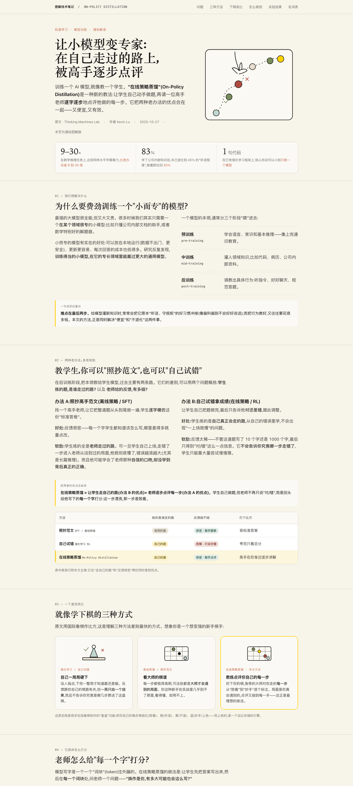

# design-artifacts

一个用于生成具有 Anthropic/Claude 设计质感的 HTML 页面、原型、报告与可视化图表的 skill。特点：暖调纸张质感、克制的排版与交互、响应式布局。

## showcase

下面是用该 skill 生成的一个案例页面（源文件：[`examples/on-policy-distillation.html`](examples/on-policy-distillation.html)）：

